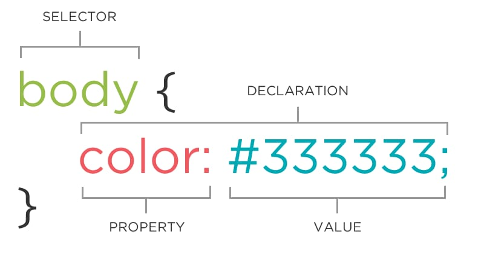

# Selectors, Declaration, Value, Properties

## CSS Selectors



```
/* select a paragraph and change the text color to blue */
p {
    color: blue;
}
```

```
/* select a link, nested in a list item, and remove the underline */
li a {
    text-decoration: none;
}
```

### Type Selectors
 
- The most basic kind of selector, simple matching pattern

```
/* Matches to ALL <h1> elements */
h1 {
    color: red;
}
```

### Universal Selector

- Matches to all elements, of any type

```
/* Applies a border to all elements */
* {
    border: 1px solid black;
}
```

> Used very rare

---

## Class and ID Selector

- Add the class attribute to the HTML element
- You define the value
- The value is the selector, starting with a period

in HTML file:

```
<p class="fancy">Fancy paragraph.</p>
<p>Regular paragraph.</p>
```

in CSS file:

```
.fancy {
    font-style: italic;
}
```

- Reusable
- Can be applied to any element
- Selector only matches to name

in HTML file:

```
<p class="fancy">Fancy paragraph.</p>
<p>Regular paragraph.</p>
<h1 class="fancy">Fancy heading</h1>
```

in CSS file:

```
.fancy {
    font-style: italic;
}
```

### Using Multiple Classes

in HTML file:

```
<p class="fancy intro">Fancy intro paragraph.</p>
<p class="fancy">Fancy paragraph.</p>
<p>Regular paragraph</p>
```

in CSS file:

```
.fancy { ... } /* only fancy styles */
.intro { ... } /* only intro styles */
```

in CSS file:

```
/* only applies if "fancy" AND "intro" are present */
.fancy.intro { ... }
```

---

## ID selector

- Add the ID attribute to the HTML element
- You define the value
- The value is the selector starting with a # symbol

in HTML file:

```
<div id="container">
    <p>Paragraph in a header.</p>
</div>
```

in CSS file:

```
#container {
    text-align: center;
}
```

> **Can only be used once per page**

in HTML file:

```
<div id="container">
    <p>Paragraph in a header.</p>
</div>

/* Not valid */
<section id="container">
    <p>Paragraph in a header.</p>
</section>
```

in CSS file:

```
#container {
    text-align: center;
}
```

### IDs and In-Page Linking

- Can be used for CSS and in-page linking

in HTML file:

```
<a href="#example">Links to a spot on the page</a>
<section id="example">Link goes here</section>
```

in CSS file:

```
#example {...}
```

### Naming Conventions

- Instead of spaces, use hyphen or underscore

```
class="class-name"
class="class_name"
id="id-name"
id="id_name"
```

- Use meaningful and descriptive names

```
.error-message {...}            (good)
```

```
.red-text {...}                 (bad)
```

- Use easily understood abbreviations

```
.button {...}
```

```
.btn {...}                      (good)
.b {...}                        (bad)
```

---

## DOM (Document Object Model)

> The Document Object Model (DOM) represents the relationships between HTML elements.

### Nested Elements and the DOM

in HTML file:

```
<section>
    <h1>Heading</h1>
    <p>Paragraph</p>
    <ul>
        <li>List Item</li>
        <li>List Item</li>
        <li>List Item</li>
    </ul>
</section>
```

### Descendent Selectors

in CSS file:

```
/* Selects only the paragraphs contained within a section */
section p { ... }
```

> selector on the *left* is **ancestor** element, the selector on the *right* is **descendent** element.

in HTML file:

```
<section>
    <p>...</p>
</section>
<p>...</p>
<p>...</p>
```

> You can also use more than two descendant elements

in CSS file:

```
/* Selects only links, inside of a paragraph, inside of section */
section p a { ... }
```

in HTML file:

```
<section>
    <p>There's a <a href="#">Link</a> inside the paragraph.</p>
    <p>Paragraph</p>
    <a href="#">Link</a>
</section>
<a href="#">Link</a>
```

in HTML file:

```
<section class="container">
    <h1>Heading</h1>
    <p>Paragraph with a <span>span</span>.</p>
</section>
```

in CSS file:

```
.container h1 {}
.container span {}
```

---

### Grouping Selectors

in CSS file:

```
/* applies to all h1 elements */
h1 {...}

/* applies to any element with this class */
.class {...}

/* applies to both h1 and h2 elements */
h1, h2 {...}

/* applies to all of these elements */
h1, h2, .class, #id {...}

section h1, h2 { }

/* expands to */
section h1 {}
h2 {}
```

in HTML file:

```
<section h1, section h2 {}
```

in CSS file:

```
/* expands to */
section h1 {}
section h2 {}
```

in CSS file:

```
h1 {
    font-weight: normal;            (bad practice)
}
h2 {
    font-weight: normal;
}
h3 {
    font-weight: normal;
}
``` 

```
h1, h2, h3 {
    font-weight: normal;            (good practice)
}
```

### Combining Selectors

in CSS file:

```
/* only applies if "fancy" AND "intro" classes are included */
.fancy.intro { ... }
```

in HTML file:

```
<p class="fancy intro">Fancy intro paragraph</p>
```

in CSS file:

```
/* applies to any elements with this class */
.intro {
    color: blue;
}
/* only applies to a <p> element with this class */
p.intro {
    font-size: 15px;
}
```

in HTML file:

```
<p class="intro">Intro paragraph</p>
```

---

### Comments in CSS

> /* This is comment in CSS */

```
p {
    color: #cc0066; /* magenta */
}
```

```
/* Header Styles */
header {
    width: 80%;
}
```