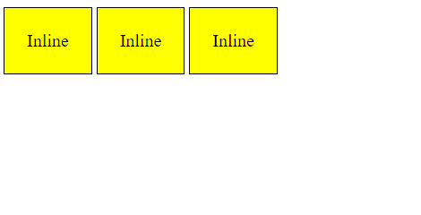

# Inline, Block, Display

### Inline 

* Takes up the same space as their content.
* Elements are displayed in a line, from the left 
* Elements will only wrap when items cannot fit
* `<a>`, `<span>`, `<strong>`



### Block

* Same height as content, same width as container
* Always starts on a new line
* `<p>`, `<h1>`, `<article>`, `<section>`


### The Display Property 

    Used to change the default behavior of inline and block-level elements

```
p {
    background: greenyellow;
    display: inline; 
    padding: 20px;
}
span {
    background: lightblue;
    display: block;
    padding: 20px;
}
```

```
display: inline-block;
```

| Before | After | Inline-block |
|---|---|---|
|  |  |  |
