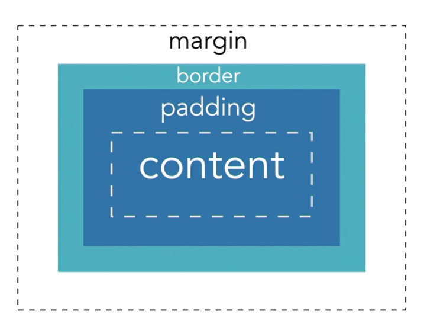
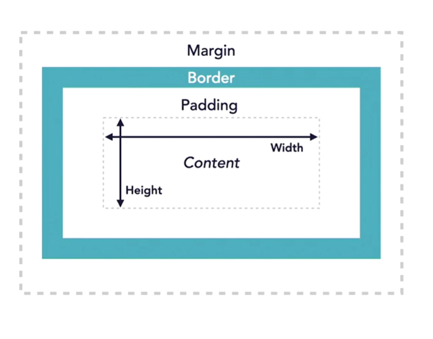

# Box Model & Box Properties

| The Box Model | Box Properties |
|---|---|
| 1. Content box | Width |
| 2. Padding box | Height |
| 3. Border box | Padding |
| 4. Margin box | Margin |
|  | Border |
|  |  |

---

## Values and Units

    For box properties, the <percentage> and <length> data types are used.

#### <percentage> Unit

```
.container {
    width: 1000px;
}
.inside-container {
    width: 50%; /* 500px */
}
```

#### Absolute <length> Unit

    px: Pixel
    cm: Centimeter
    mm: Millimeter
    in: Inch
    pc: Pica (equal to 1/6 of an inch)
    pt: point (equal to 1/72 of an inch)
    width: 1000px;

#### Relative <length> Unit

    em: Represents inherited font-size of element
    rem: Represents the font-size of the root element
    
    1vw = 1% of the width of the viewport
    1vh = 1% of the height of the viewport
    vmin: Equal to the smaller of vw and vh
    vmax: Equal to the larger of vw and vh

---

## Box Properties (sintax and usage)

#### Width and Height

> The **width** and **height** properties change the size of the content box. Inline elements require the display property.

```
/* Block element */
div {
    width: 100px;
    height: 100px;
}
```

```
/* inline-element */
span {
    width: 100px;
    height: 100px;
    display: block;
    /* OR */
    display: inline-block;
}
```

---

#### Padding

> **Padding** adds/removes space inside of the element but around the content box.

```
/* longhand */
padding-top: 2px;
padding-right: 2px;
padding-bottom: 2px;
padding-left: 2px;
```

```
/* shorthand */
padding: 2px 2px 2px 2px; /* top right bottom left */
```

##### Padding Shorthand Syntax

> The shorthand syntax can use 1-4 values.

```
padding: 2px; /* same on all sides */
padding: 2px 10px; /* top & bottom, right & left */
padding: 2px 10px 5px; /* top, right & left, bottom */
```

> You can also mix different types of length units.

```
padding: 10px 2%; /* top & bottom, right & left */
```

```
/* valid */
padding: 0px;
padding: 0;
padding: 2px 0;
```

```
/* not valid */
padding: 2;
padding: -10;
```

---

#### Margin

> Margin adds/removes space around the element.

```
/* longhand */
margin-top: 2px;
margin-right: 2px;
margin-bottom: 2px;
margin-left: 2px;
```

```
/* shorthand */
margin: 2px 2px 2px 2px; /* top right bottom left */
margin: 2px 10px 5px; /* top, right & bottom, left */
margin: 2px 10px; /* top & bottom, right & left */
margin: 2px; /* same on all sides */
```

---

#### Border

> The border property displays a border between the margin and padding.

```
/* shorthand */
border: 2px solid red;
```

```
/* longhand */
border-width: 2px;
border-style: solid;
border-color: red;
```

##### border-width, -color, -style

```
border-width: 10px;
border-width: thin;
border-width: medium;
border-width: thick;
```

```
border-color: blue;
border-color: #000000;
```

```
border-style: none;
border-style: hidden;
border-style: dotted;
border-style: dashed;
border-style: solid;
border-style: double;
border-style: groove;
border-style: ridge;
border-style: inset;
border-style: outset;
```
