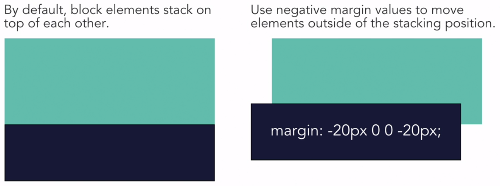
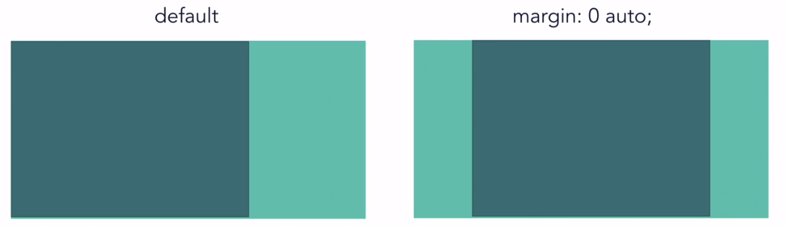

# Margin and Layouts

### Margin and Negative Values



---

### Center aligning with margin



##### Example

```
.example {
    width: 1000px;
    margin: 0 auto; /* top & bottom, left & right */
}
```
