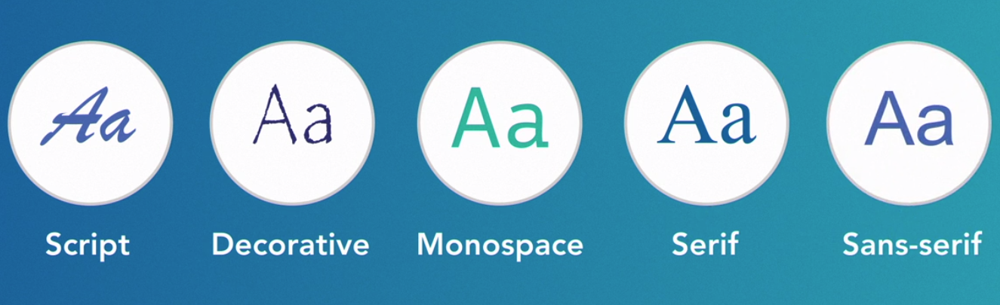
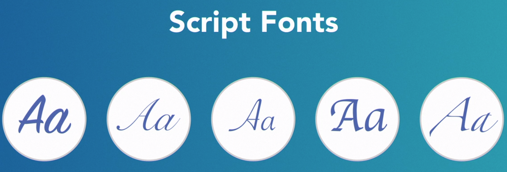
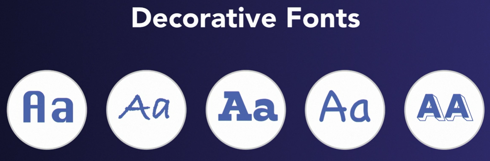
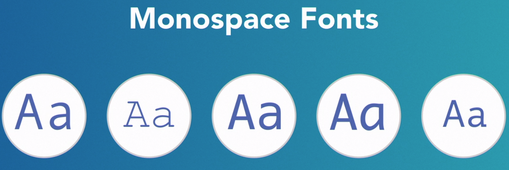
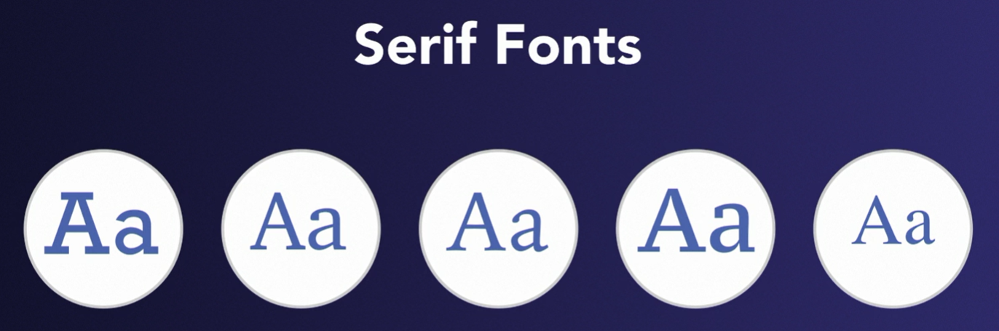
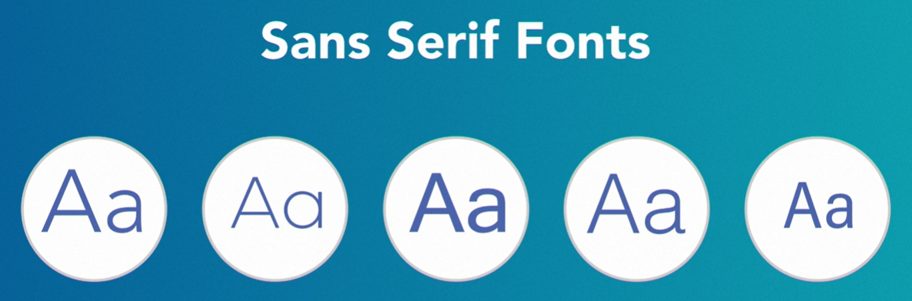

# Typography & Typeface

### Typography

    Arranging type for readability and to engage and communicate with the reader.

### Typeface

    A set of fonts designed with common characteristics, composed of glyphs.

| Font | Used For |
|---|---|
|  | often used for formal style, traditional style, legal documents |
|  | designed to be a casual font; childlike, fun style | 

---

## Typefaces

    There are five categories of typefaces

> *Script*, *Decorative*, and *Monospace* typefaces have more specific usage, and are used sparingly.
>
> *Serif* and *San-serif* are typefaces that you'll probably use the most often.

---

### Script fonts

> *Script* typefaces have hand-lettered look and tend to be harder to read in small sizes.
>
> Often used for *invitations, greeting cards, logos, and branding materials*.

---

### Decorative fonts

> *Decorative* typefaces are ornamental. 
>
> Primary used to evoke an essence, feeling, or visual message for specialty items including headings and hero art.

---

### Monospace fonts

> *Monospace* - each character uses the same amount of horizontal space, each character is the same width, whether it's a narrow 'I' or a wider 'O'.
>
> Often used to display code.

---

### Serif fonts

> *Serif* - are distinguished by small, decorative lines, usually at the top or at the bottom of the letters.
>
> Tend to be viewed as traditional and formal.

---

### San-Serif fonts

> *Sans-Serif* - do not have decorative lines and often thought of as contemporary and modern. 
>
> Signs, text in apps, and names on maps tend to be sans serif.
