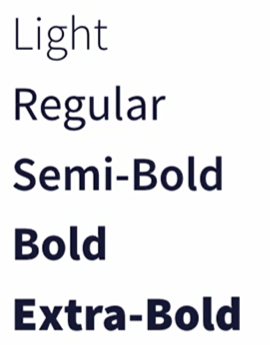
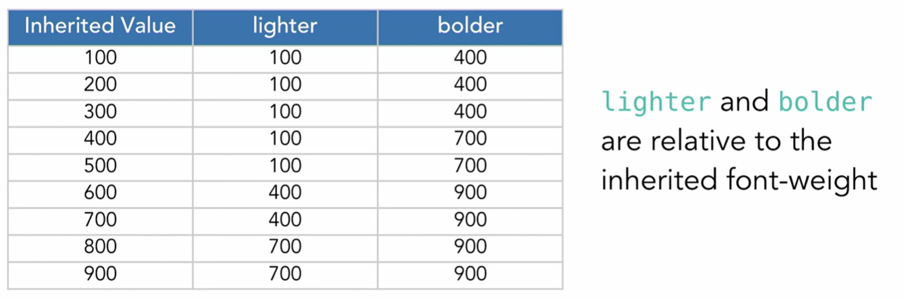

# Font-family

```
body {
    font-family: Helvetica, Arial, sans-serif;
}
```

### Generic font-family Names

    serif (serif fonts)
    sans-serif (sans-serif fonts)
    cursive (script or decorative fonts)
    fantasy (decorative fonts)
    monospace (monospace fonts)

### Web-Safe Fonts

> Fonts that are commonly pre-installed on the majority of computers or devices (Examples: Arial, Times New Roman)
>
> **Note:** Fonts may vary among operating systems.

---

font-family **and Quotes**

```
p {
    font-family: Ahem!, sans-serif; /* not valid */
    font-family: Ahem\!, sans-serif; /* escaped, valid */
}
```

font-family **Names**

```
p {
    font-family: Ahem!, sans-serif; /* not valid */
    font-family: Ahem\!, sans-serif; /* escaped, valid */
    font-family: "Ahem!", sans-serif; /* double quoted, valid */
    font-family: 'Ahem!', sans-serif; /* single qouted, valid */
}
```

font-family **Names**

```
p {
    font-family: "Gill Sans", sans-serif; /* valid and recommended */
    font-family: Gill Sans, sans-serif; /* valid */
}
```

---

## font-weight and font-style

#### font-weight




```
font-weight: 100; /* lightest or thinnest */
font-weight: 200; 
font-weight: 300; 
font-weight: 400; 
font-weight: 500; 
font-weight: 600; 
font-weight: 700; 
font-weight: 800; 
font-weight: 900; /* darkest or thickest */
```

    100 - Thin
    200 - Extra Light (Ultra Light)
    300 - Light
    400 - Normal
    500 - Medium
    600 - Semi Bold (Demi Bold)
    700 - Bold
    800 - Extra Bold (Ultra Bold)
    900 - Black (Heavy)

---

#### font-weight **Keywords** 

* **normal** is equal to 400 and is also the default for body text
* **bold** is equal to 700 and is the default for headings
* there is also two more *keywords* in the picture below



---

#### font-style 

> font-style - used to add or remove an italic style. There are three values: **italic, oblique, and normal.**

```
p {
    font-style: italic; /* add italic style */
}
em {
    font-style: normal; /* removes italic style */
}
```
