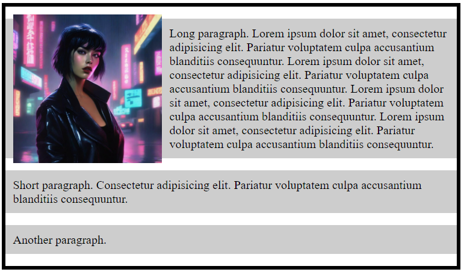
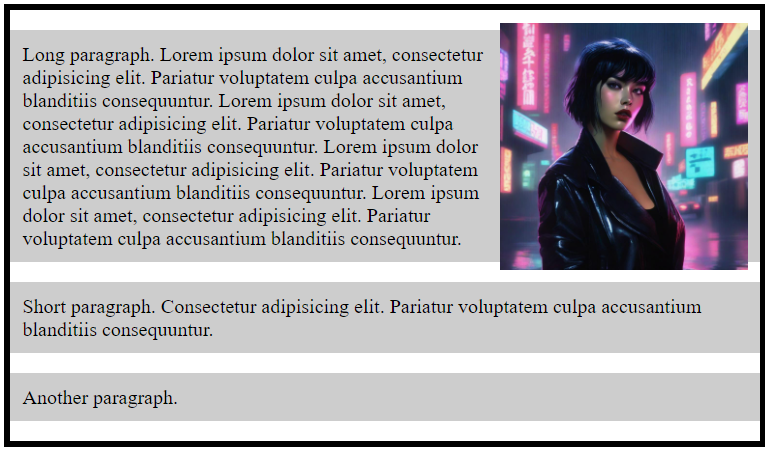
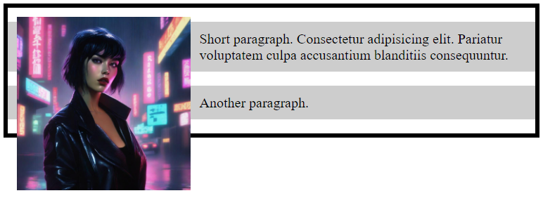
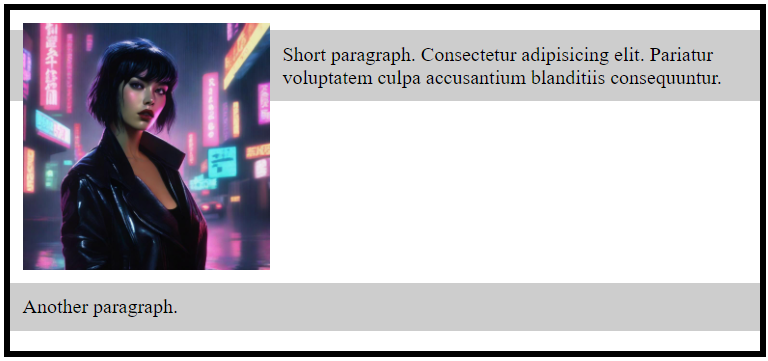

# Layouts: Float and Position

## Introduction to float

### Float property

> The ***float*** property can be used to change the normal document flow by floating elements to the *left* or *right* side of its container.

| Before | After (using <float: left;>) | After (using <float: right;>) |
|---|---|---|
|  |  |  |

### Clear property

> When we use the ***float*** property, and we want the next element *below* (not on *right* or *left*), we will have to use the ***clear*** property.

| Before | After (using <clear: both;>) |
|---|---|
|  |  |
