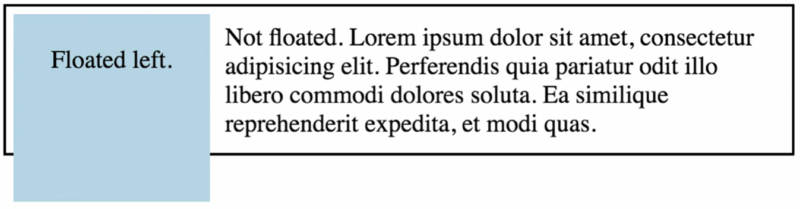
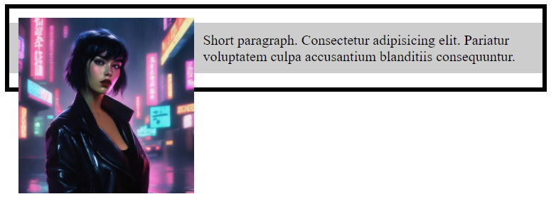
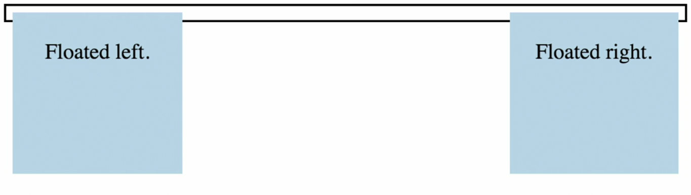
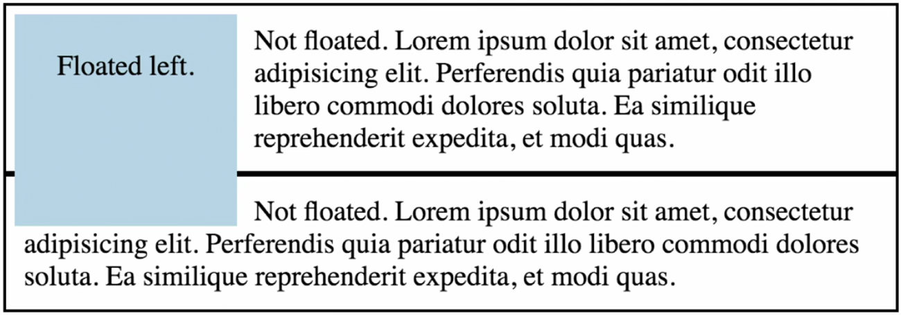
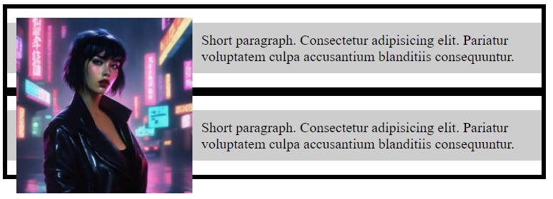
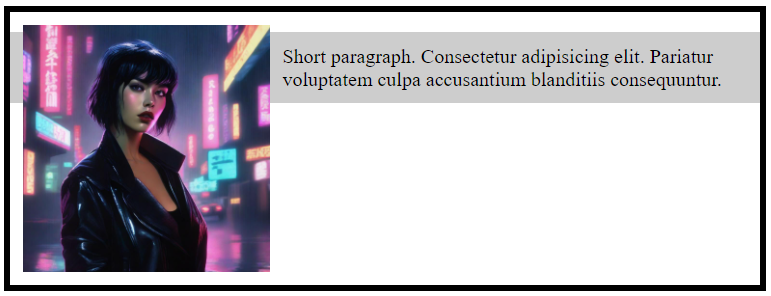
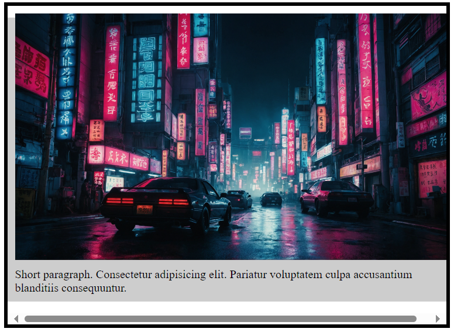
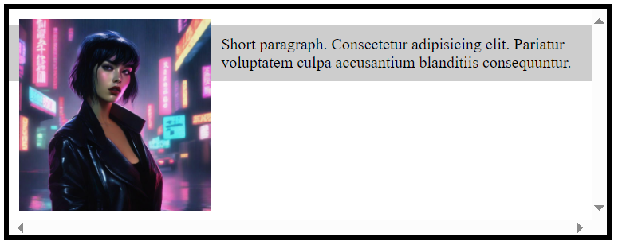
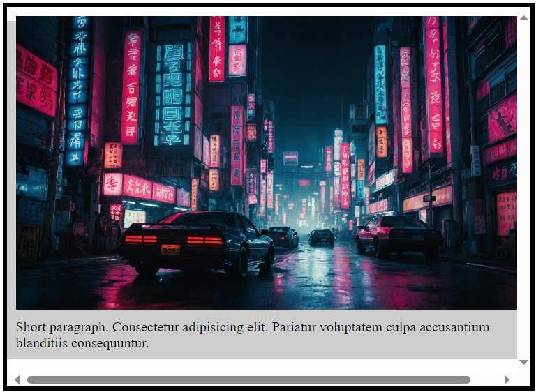
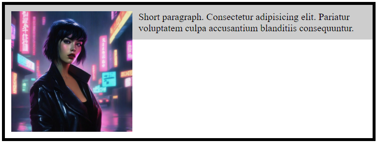

# Float and Collapsed Container

| Case | Problem | Example |
|---|---|---|
|  | Parent elements will only wrap around non-floated child elements. |  |
|  | If all the elements within the parent are floated, the height of the parent container will collapse. |  |
|  | Any elements following the floated element will stack underneath. Content will flow around. |  |

> When there are no elements to apply a ***clear*** to, a *self-clearing* technique is applied to the parent.

---

### There are 3 options:

#### Option 1: overflow

```
<div class="parent">
    <div class="floated">...</div>
    <div class="floated">...</div>
</div>
```

```
.floated {
    float: left;
}
.parent {
    overflow: hidden;
    /* OR */
    overflow: auto;
}
```

| Case | Description | Example 1 | Example 2 |
|---|---|---|---|
| auto | overflow: auto; adds scroll bar, but only when there is overflowing content. |  |  |
| hidden | overflow: hidden; this may be used for image, but isn't very useful for text, since clipped content can't be accessed. |  |  |
| scroll | overflow: scroll; will always show a scroll bar on the X and Y axis, even when the content does not flow outside of its container. |  |  |

---

#### Option 2: "clearfix" Hack

```
<div class="clearfix">
    <p>floated element</p>
    <p>floated element</p>
</div>
```

```
.clearfix:after {
    content: "";
    display: table;
    clear: both;
}
```

| Case | Description | Example |
|---|---|---|
| "clearfix" Hack | CSS snippet added to the parent of floated elements. |  |

---

#### Option 3: display: flow-root;

```
<div class="parent">
    <p>floated element</p>
    <p>floated element</p>
</div>
```

```
.parent {
    display: flow-root;
}
```

| Case | Description | Example |
|---|---|---|
| display: flow-root; | **not currently supported in all browsers** |  |


