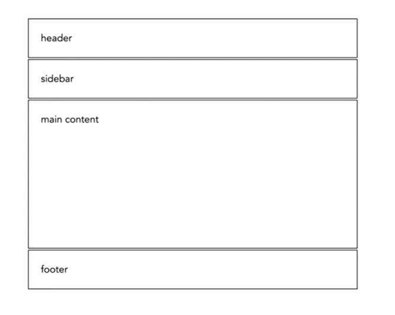
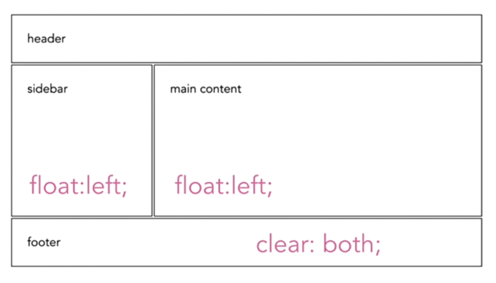
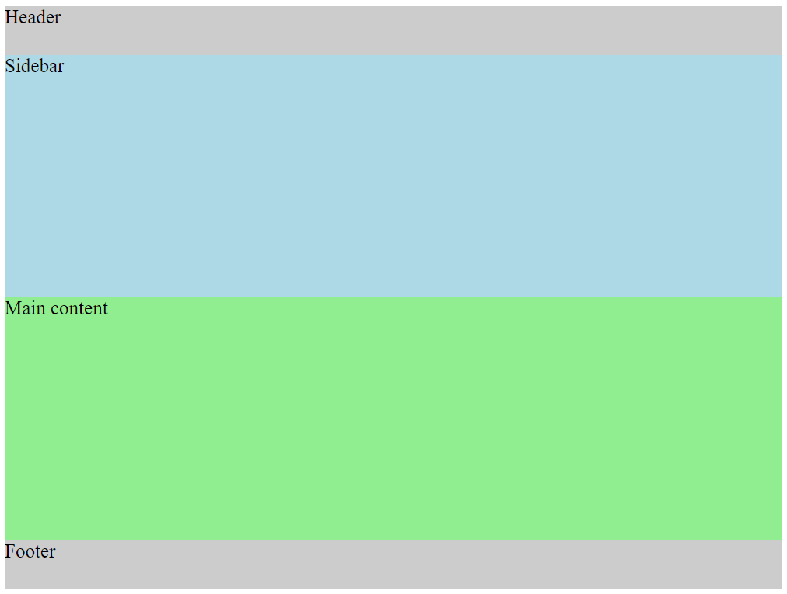
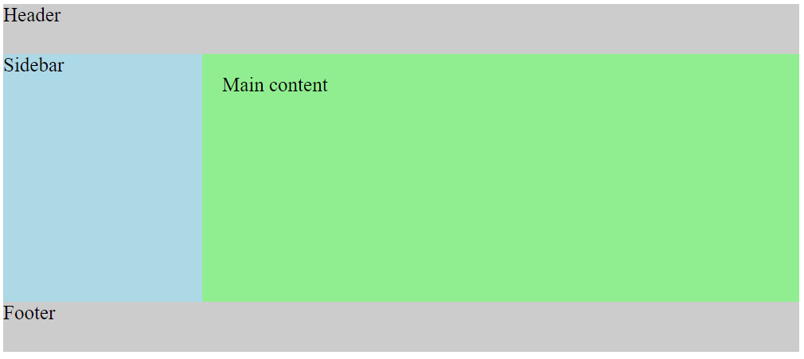
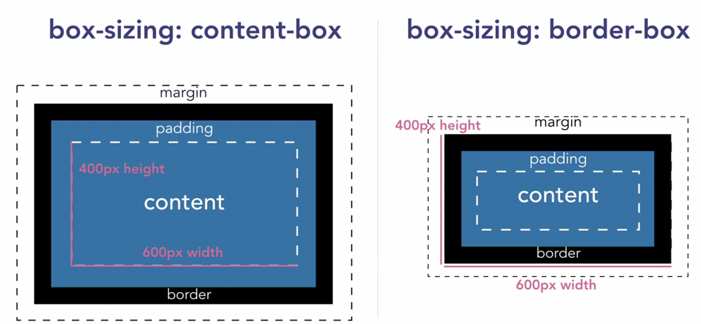
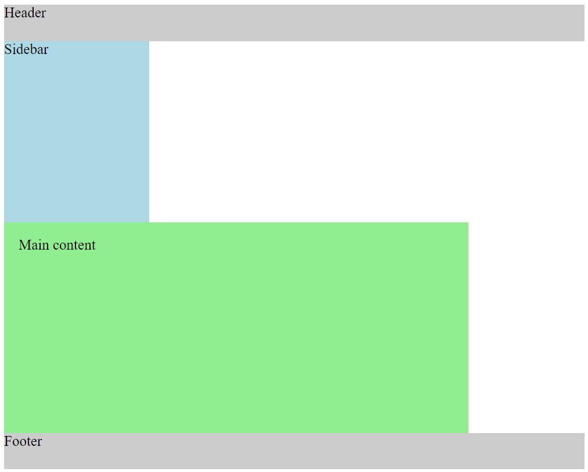

# Layouts and The Box Model

| Before | After |
|---|---|
|  |  |
|  |  |

```
<div class="wrapper">
    <header>Header</header>
    <aside class="sidebar">Sidebar</aside>
    <article class="main-content">Main content</article>
    <footer>Footer</footer>
</div>
```

```
header, footer {
  height: 50px;
}
.sidebar {
  float: left;
}
.main-content {
  float: left;
}
footer {
  clear: both;
}
```

---

### Box-sizing

* *padding* increase the size of the elements, so we can use *box-sizing: border-box;* to fix it.

* *margin* just adds the space around the element.



```
/* border box fix */
html {
    box-sizing: border-box;
}
*, *:before, *:after {
    box-sizing: inherit;
}
```

| Before | After |
|---|---|
|  |  |
