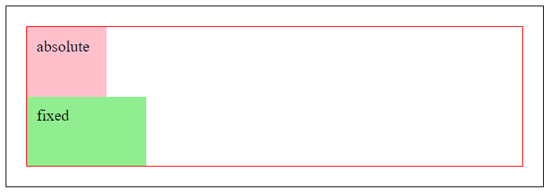

# Position

> The ***position*** property can also be used to change the flow of the document.
>
> There are 5 different values: *static, relative, absolute, fixed, sticky.*
>
> *static* is the initial value, which means elements are not positioned.
>
> The 4 other values: *relative, absolute, fixed, and sticky* are positioned by arranging elements, reletive to its current position, its containing element, or the browser view port.

| value | description |
|---|---|
| **static:** | not positioned |
| **relative:** | relative to current position |
| **absolute:** | relative to containing element |
| **fixed:** | relative to the viewport |
| **sticky:** | relative to containing element and viewport |

> For all these values, except *static*, the *top, right, bottom, and left* properties must also be used to specify the placement of the positioned elements.

---

### Relative

```
.box {
    position: relative; 
    top: 10px; 
    right: 30px;
}
```

| Before | After |
|---|---|
|  |  |

---

### Absolute

```
.box {
    position: absolute;
}
```

| Before | After (fixed box now behind the absolute box) |
|---|---|
|  |  |

```
.box {
    position: absolute;
    right: 25%;
    bottom: 75%;
}
```

| Before | After (absolute box now in certain area) |
|---|---|
|  |  |

---

### Fixed

```
.box {
    position: fixed;
}
```

| Before | After (puts fixed box in front of text) |
|---|---|
|  |  |

```
.box {
    position: fixed;
    top: 0;
    right: 0;
}
```

| fixed (at the top of the page) | fixed (after scrolling to the bottom of the page) |
|---|---|
|  |  |

> **Fixed** positioning is always positioned relative to the view point and stays in the same spot even on page scroll.

---

### Sticky

> *This is still experimental and not a recommendation yet. 

```
.box {
    position: sticky;
    top: 10px;
}
```

| Case | Image |
|---|---|
| Before |  |
| After a little scroll (box position is less than 70 px) |  |
| After big scroll (box position is sticked to 10 px) |  |
| Once you scroll past it's contining element |  |

> With **sticky** positioning, it stays in the *initial* spot until you scroll the page. Then it becomes fixed when the value in the offset property has been met. 
