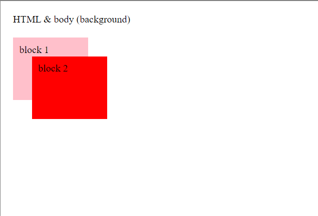

# Z-index

> The ***z-index*** property specifies the stack order of an element.

---

### Stacking order

* ***root elements** (html, body)*
* ***block-level elements** (in order that they appear in the HTML)*
* ***floated elements** (that are not positioned)*
* ***in-line elements** (in order that they appear in the HTML)*
* ***positioned elements** (in order that they appear in the HTML)*
* ***z-index** (the higher the value, the higher the element)*

> **Note:** *z-index* only works on positioned elements (position:absolute, position:relative, or position:fixed).

---

### Example

| Element | Example |
|---|---|
| *root element* |  |
| *block-level element 1* |  |
| *block-level element 2* |  |
| *float* |  |
| *in-line* |  |
| *position* |  |
| *z-index 1* |  |
| *z-index 2* |  |
