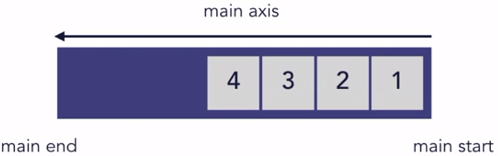
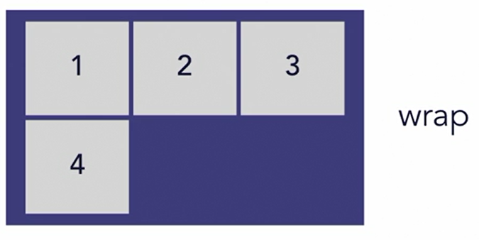

# Flexbox and Grid

> Flexbox - items are aligned on a single axis. It is often described as being one-dimensional.

> Grid layouts are thought of as two-dimensional, because it can arrange items into rows and columns at the same time.

| Flexbox | Grid |
|---|---|
| Distribution across a single axis | Layouts with both rows and columns |

---

## Flexbox

* **flex container:** the parent element
* **flex items:** the child elements

```
<section class="flex-container">
    <div>flex item
        <div>not a flex item</div>
    </div>
    <div>flex item</div>
    <div>flex item</div>
    <div>flex item</div>
</section>
```


---


* The direction of the main axis can be changed to run vertically using the *flex direction* property.

```
<div class="container">
    <div>flex item</div>
    <div>flex item</div>
    <div>flex item</div>
    <div>flex item</div>
</div>
```

```
.container {
    display: flex;
    /* OR */
    display: inline-flex;
}
```


---

### flex-direction

> flex-direction - determines the direction of the main axis
>
> There are four values: *row, row-reverse, column and column-reverse.*

| Property | Image |
|---|---|
| flex-direction: row |  |
| flex-direction: row-reverse |  |
| flex-direction: column |  |
| flex-direction: column-reverse |  |
| flex-wrap: nowrap |  |
| flex-wrap: wrap |  |
| flex-wrap: wrap-reverse |  |

---

#### flex-flow Shorthand

```
/* shorthand */
flex-flow: column wrap;

/* longhand */
flex-direction: column;
flex-wrap: wrap;
```
