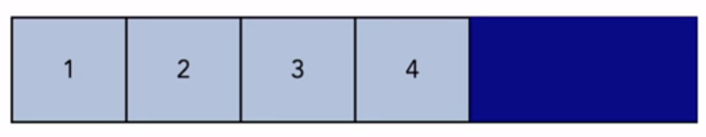
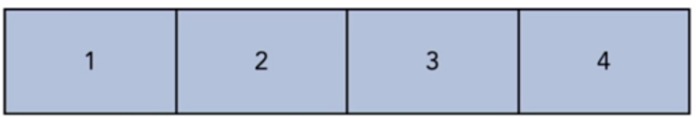
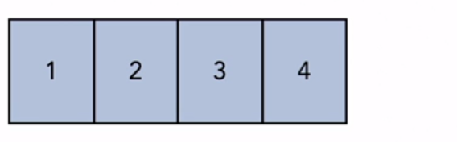
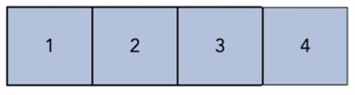
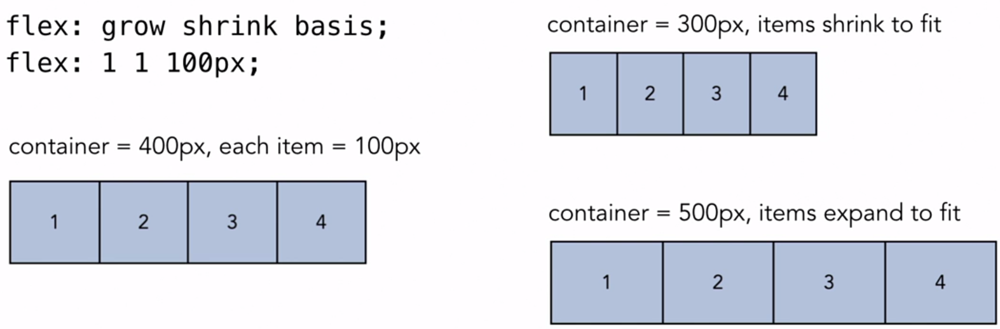
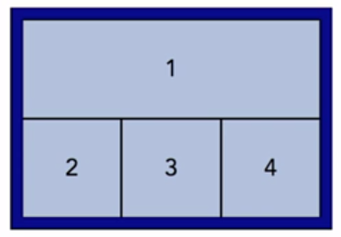

# flex- Properties

* flex-basis: sets the initial size of the flex-items
* flex-grow: determines how items will expand if there is extra space in the container
* flex-shrink: determines how items will shrink if there isn't enough space in the container

---

## flex Shorthand

### flex-grow

```
flex: grow shrink basis;
flex: 0 1 100px;
```

* The first value,*flex-grow*, defaults to 0, that means, if there is extra space in the container, **do not expand** to fill the space.



```
flex: grow shrink basis;
flex: 1 1 100px;
```

* If we change the *flex-grow* value to 1, all the flex items **will expand** by the same amount to fill up the space.



---

### flex-shrink

```
flex: grow shrink basis;
flex: 0 1 100px;
```

* The second value,*flex-shrink*, defaults to 1, that means, if there isn't enough space in the container, **shrink** all the flex items by the same amount.



```
flex: grow shrink basis;
flex: 0 0 100px;
```

* If we change the *flex-shrink* value to 0, that means, it **won't shrink** at all.



---

### flex-basis

```
flex: grow shrink basis;
flex: 0 1 100px;
```

* The third value,*flex-basis*, if there is enough space, make all the flex items the size declared with this value. If not then shrink or grow according to the first two values.



---

## Code Example

```
<div class="flex-container">
    <div class="flex-item">1</div>
    <div class="flex-item">2</div>
    <div class="flex-item">3</div>
    <div class="flex-item">4</div>
</div>
```

```
.flex-container {
    display: flex;
}
.flex-item {
    flex: 1 1 100px;
}
```

---

    If you want the items to be sized differently, then flex must be applied to the individual flex items.



```
<div class="flex-container">
    <div class="flex-item-first">1</div>
    <div class="flex-item">2</div>
    <div class="flex-item">3</div>
    <div class="flex-item">4</div>
</div>
```

```
.flex-container {
    display: flex;
}
.flex-item-first {
    flex: 0 0 100%;
}
.flex-item {
    flex: 1 1 auto;
}
```
